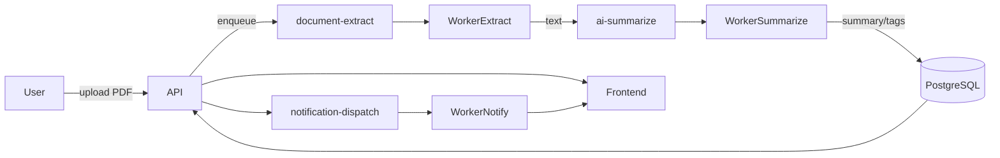

# AI-driven Internal Task Collaboration and Document Processing Platform — DESIGN

## System Goal and Use Cases

The goal of this project is to design an internal collaboration platform that helps teams manage tasks and process uploaded PDF documents with an AI-assisted pipeline.

The intended use cases include:

- team members logging in and viewing role-based task dashboards
- managers assigning tasks and tracking task progress
- admins reviewing system activity and audit logs
- users uploading PDF documents linked to tasks
- background workers extracting text and generating summaries/tags
- sending notification stubs for task or document-related events

Although the full architecture includes backend APIs, workers, queues, and AI/document modules, the implementation is intentionally designed to be completed in stages through Roo Code orchestration.

## Scope & Constraints (v1)
- Upload: PDF only; OCR out of scope.
- AI: replaceable adapter with mock provider by default; no hard dependency on external AI.
- Notifications: email/webhook stubs; delivery optional in v1.
- Multi-tenant: out of scope.
- API: REST only (/api/v1/**).
- Security: mask sensitive fields (email, phone, token, password, secret values) in audit logs and logs.
- Background: BullMQ on Redis; jobs idempotent with retry/backoff + DLQ.
- Deployment: Docker Compose baseline (PostgreSQL, Redis, backend, frontend, worker).

## Architecture Overview
- Frontend: Next.js (app router), role-aware UI, uses REST via typed client.
- Backend API: NestJS modular monolith (modules: auth, rbac, users, tasks, documents, ai, notifications, scheduler, audit, health).
- Workers: NestJS worker process for BullMQ queues (document-extract, ai-summarize, ai-tag, notification-dispatch).
- Database: PostgreSQL; relational with auditability; migration tool TBD.
- Cache/Queue: Redis for BullMQ and lightweight caching.
- Storage: local volume or object storage placeholder for PDF; path tracked in documents table.

## Module Boundaries
- Auth/RBAC: JWT + refresh; guards; role/permission checks.
- User/Role: CRUD, seed, role binding.
- Task Management: task lifecycle, assignment, attachments (documents), status transitions, task events for audit.
- Document Processing: upload PDF → store → enqueue extract job → enqueue summarize/tag jobs → persist results.
- AI Pipeline: adapter interface + mock provider; pipeline orchestrated by BullMQ; results persisted to ai_results and documents.status.
- Notification: event-driven; email/webhook stubs; preference placeholder.
- Scheduler/Background: cron for stale tasks reminders, retries, cleanup; runs in worker process.
- Audit Log: interceptor for API + selected domain events; masking sensitive fields; queryable endpoint.
- Health/Observability: health checks, structured logging; minimal metrics placeholder.

## Data Model (tables)
- users
- roles
- permissions
- user_roles
- role_permissions
- tasks (status, assignee_id, due_at, priority, title, description)
- task_events (task_id, actor_id, action, before, after, created_at)
- documents (task_id, storage_path, mime, status, uploaded_by, uploaded_at)
- ai_results (document_id, summary, tags JSONB, model, score, started_at, completed_at)
- notifications (user_id, type, payload, status, sent_at)
- notification_templates (code, channel, template body)
- audit_logs (actor, action, resource, resource_id, before, after, masked_fields, trace_id, created_at)

## Queues (BullMQ)
- document-extract: PDF text extraction (no OCR).
- ai-summarize: generate summary via adapter/mock.
- ai-tag: generate tags via adapter/mock.
- notification-dispatch: send email/webhook stubs.
- DLQ per pipeline with retry/backoff policy (exponential).

## API Surface (REST /api/v1)
- /auth: POST /login, POST /refresh, GET /me
- /users: CRUD; role binding
- /roles: CRUD; permissions management
- /tasks: CRUD; status transition; assign; attach documents
- /documents: POST /upload (PDF), GET /:id/status, GET /:id/ai-results
- /notifications: GET list, POST mark-read
- /admin/audit: GET query audit logs (with masking enforced)
- /health: liveness/readiness

## Frontend (Next.js) Pages
- /login, /tasks, /tasks/[id], /documents/[id], /admin/audit, /settings/notifications
- Components: TaskList/Board, TaskDetail, DocumentViewer, NotificationCenter, AuditTable
- Auth handling: HTTP-only cookie preferred; role-based navigation.

## Security & Compliance
- Env validation; secrets via env (no commit); CORS allowlist; helmet; rate limiting.
- Input validation via DTO + class-validator; output typing.
- Audit masking for email/phone/token/password/secret values; deterministic mask function.
- Logging: structured; avoid sensitive fields; correlation id/trace id.

## AI Adapter Strategy
- Define AIAdapter interface with methods for summarize(tags optional) and tag generation.
- Provide MockAIAdapter default; external provider adapter pluggable via config.
- Pipeline resilient to adapter failure; results stored in ai_results with model/source metadata.

## Notification Strategy
- Channels: email, webhook (stubs).
- Event → notification-dispatch job; templating via notification_templates.
- Delivery status tracked; failures retried; DLQ on persistent failure.

## Background & Scheduler
- Cron jobs for stale task reminders, retry of failed jobs, cleanup of temp files.
- Runs in worker container; shares codebase with API but separate process.

## Deployment (Docker Compose)
- Services: backend-api, backend-worker, frontend, postgres, redis.
- Volumes for postgres data and uploaded files.
- Env files: .env.example per service.

## Testing Strategy
- Unit: services/guards/pipes.
- Contract: REST (supertest) against OpenAPI spec.
- E2E happy path: login → create task → upload PDF → AI pipeline → notification stub.
- Workers: job processors tested with mock adapters and in-memory Redis (or test containers).

## Why This Project Requires Orchestration

This project is not a single-page app or a one-feature prototype. It is designed as a multi-module engineering system that spans frontend UI, backend API, authentication and RBAC, task management, document processing, AI-assisted analysis, notifications, background workers, and deployment concerns.

Because of this scope, it is not reasonable to expect a single prompt to generate a complete and well-structured result in one step. If Roo Code were only told to "build the whole project," several problems would likely occur:

- the scope would expand too quickly
- modules would become mixed together without clear boundaries
- it would be difficult to preserve a clean commit history
- design documents and implementation could easily become inconsistent
- later debugging and correction would be much harder

For that reason, this project was intentionally planned to use orchestration. The work needed to be divided into stages, with each stage focusing on a limited goal, clear boundaries, and explicit deliverables. In practice, this meant starting from architecture and scaffolding, then gradually moving toward a frontend demo dashboard, persistence behavior, validation, and finally runtime fixes and documentation polishing.

In other words, orchestration was necessary not only because the system itself is complex, but also because the assignment emphasizes engineering-style collaboration with AI rather than one-shot code generation.

## Orchestration Roles and Expected Collaboration Flow

To complete this project with Roo Code, I treated the workflow as a collaboration among several engineering roles rather than a single "code generator" action.

### Roles

- **Planner**  
  Break the project into stages, define priorities, and prevent the scope from becoming unmanageable.

- **Architect**  
  Propose the system structure, module boundaries, data flow, and control flow.

- **Coder**  
  Implement the specific features allowed in the current stage.

- **Reviewer**  
  Check whether the output matches the requested scope, identify placeholders, and point out inconsistencies.

- **Tool Runner**  
  Inspect files, review repository state, observe runtime errors, and support multi-step debugging and refinement.

### Expected collaboration flow

1. **Plan before implementation**  
   Roo Code first proposes the architecture, module split, and stage plan before writing major code.

2. **Constrain the current stage**  
   Each prompt clearly limits what is allowed in the current phase and what must not be implemented yet.

3. **Implement in small steps**  
   Features are added incrementally instead of asking for the full system at once.

4. **Report intermediate results**  
   After each step, Roo Code reports modified files, completed behavior, placeholder areas, and a suggested commit message.

5. **Correct direction when needed**  
   If the output drifts away from the intended scope, the next prompt is used to refine or restrict the direction instead of manually editing the code.

6. **Debug and stabilize**  
   When runtime issues appear, Roo Code is guided through error-based prompts to fix them while preserving the already completed functionality.

This orchestration flow is important because it makes the development process traceable, reviewable, and aligned with the assignment goal of using AI as an engineering collaborator.

## Current Submission Scope

The full system design includes multiple backend and worker modules, but the current submission focuses on a frontend demo dashboard produced through staged orchestration.

The implemented demo currently includes:

- demo login flow
- role-aware dashboard for employee, manager, and admin
- mock authentication persistence with localStorage
- demo task persistence with localStorage
- task status updates
- manager/admin demo task creation
- reset flow, validation, and empty states
- README and usage notes

The remaining modules in this design document are kept as planned future stages rather than fully implemented features in the current repository.

## Stage Overview (summary)
- Stage 0: scaffold, env, contracts, compose baseline.
- Stage 1: Auth/RBAC/User baseline + audit masking foundation.
- Stage 2: Task core.
- Stage 3: Document + AI pipeline (PDF, mock adapter, no OCR).
- Stage 4: Notification + scheduler (stubs).
- Stage 5: Admin/Audit UI/queries.
- Stage 6: Hardening + tests + CI.

## Mermaid (logical flow)

